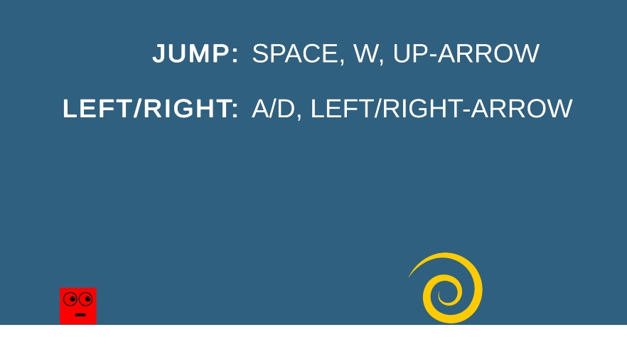

  

<h1 align="center"><strong>Bloop</strong></h1>

  A bite-size, minimalistic 2-D platformer packed with hidden Easter eggs. 
  Collect them all, unlock the secret level, and hop through portals to reach the finish!

---

## 🎮 Play it

| Link |
|------|
| **[Download Bloop](https://drive.google.com/drive/folders/1ofNYWiFoPyVjRL5LWic3DHSDaxCvfaQx?usp=sharing)** |

> **Windows:** unzip and double-click `Bloop.exe`.  
> **macOS / Linux:** run the launch script in the root folder.

If the download doesn’t work, clone this repo and build the game in **Unity 2D**. Quick video guide → <https://youtu.be/7nxKAtxGSn8?t=292>.  
*Remember to select every scene in **Build Settings → Scenes In Build** before pressing **Build**.*

## 🖼️ Screenshots

  <kbd>
    
    
        
  </kbd>

## 🗺️ How to Play

| Action        | Keys |
|---------------|------|
| **Move**      | `←` / `→` **or** `A` / `D` |
| **Jump**      | `Space` |
| **Restart**   | `Esc` → **Restart** |
| **Goal**      | Reach the portal to advance. Grab every Easter egg to unlock the secret level! (It's possible, trust me) |

## 🔄 Resetting Progress

How to reset level progress as a developer:

1. Open **`Scripts/GameUtil.cs`**  
2. *Comment out* the two lines marked **comment-out when reseting level data**  
3. *Uncomment* the three lines marked **Uncomment when reseting level data**  
4. Play Level 1 — the game will auto-skip to the last level, clearing the save.  
5. Revert the changes when you’re done.
